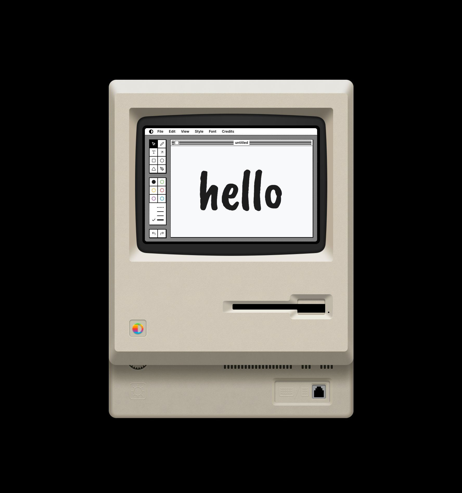
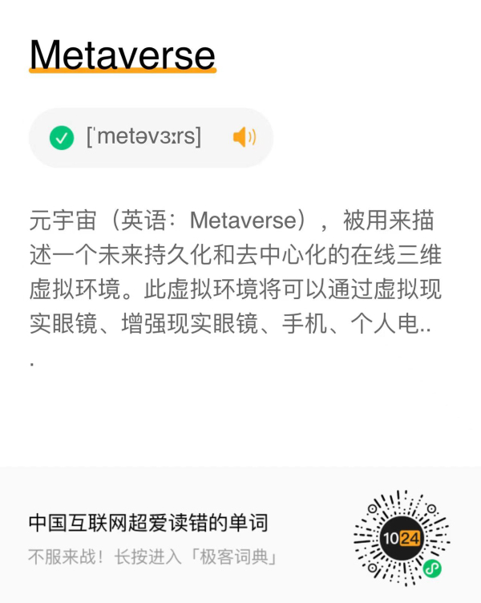

# 酷玩周刊 第 1 期

## 🚀 产品试玩

**[Shottr](https://shottr.cc/)**

小巧好用的免费截图工具，支持滚动截屏、马赛克、标注、OCR、取色等功能，目前仅支持 macOS。

**[Paint](https://paint.withdiagram.com/)**

在网页中复刻了苹果公司第一代 Macintosh 个人电脑的绘画软件 MacPaint。

## 📚 影音推荐

**[《挽救计划》](https://github.com/Anduin2017/HowToCook)**

小学老师和外星甲壳虫联手拯救太阳系，极具画面感的科幻小说，节奏紧张又不失温情。《火星救援》作者安迪·威尔的又一力作。

## 😛 新奇古怪

**[《程序员在家做饭方法指南》](https://github.com/Anduin2017/HowToCook)**

程序员学做饭似乎更喜欢用极客的方法，这是一个 Github 上的开源项目，任何人都可以修改菜谱并提交 Pull request。

## 📝 每周一词

## ☎️ 关注订阅

- [欢迎投稿]()
- 关注公众号：[酷玩周刊](/doc/asset/2022/img2022021803.jpg)
- 社交账户：[微博]()、[Twitter]()、[竹白](https://coldplay.zhubai.love/)
- 制作团队：[ThusLab](https://thuscn.com/lab/)

