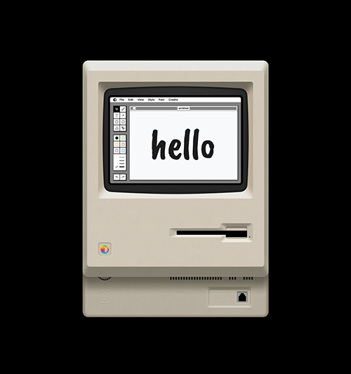
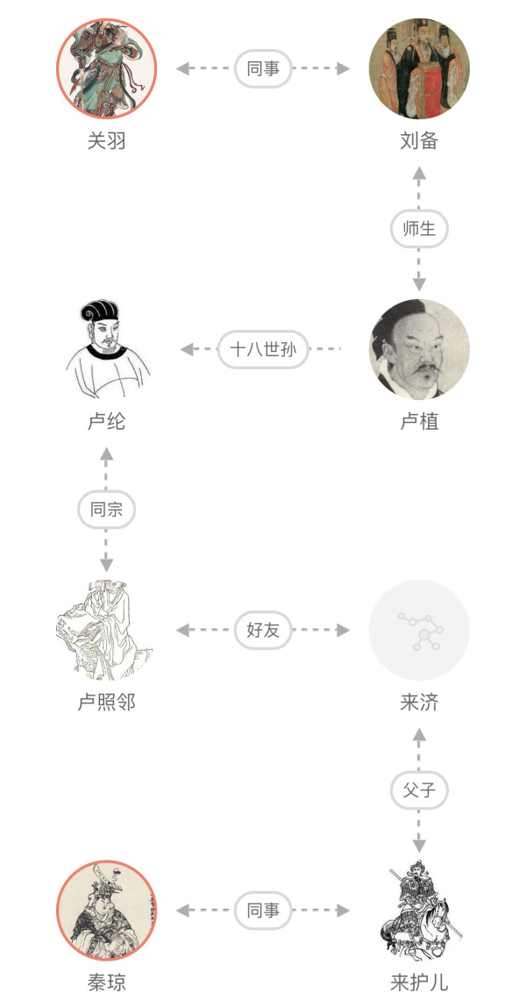
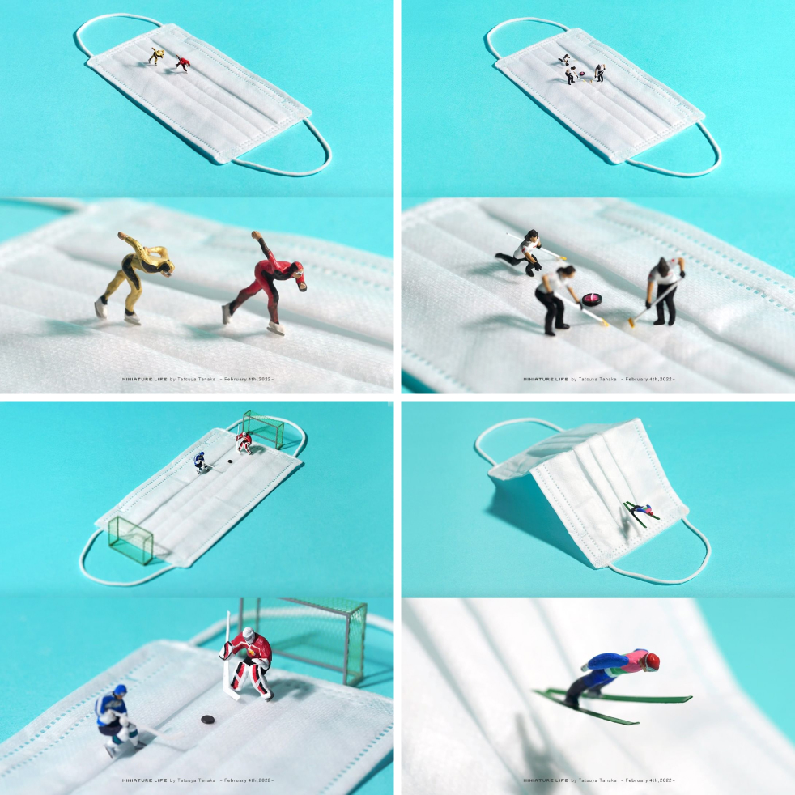
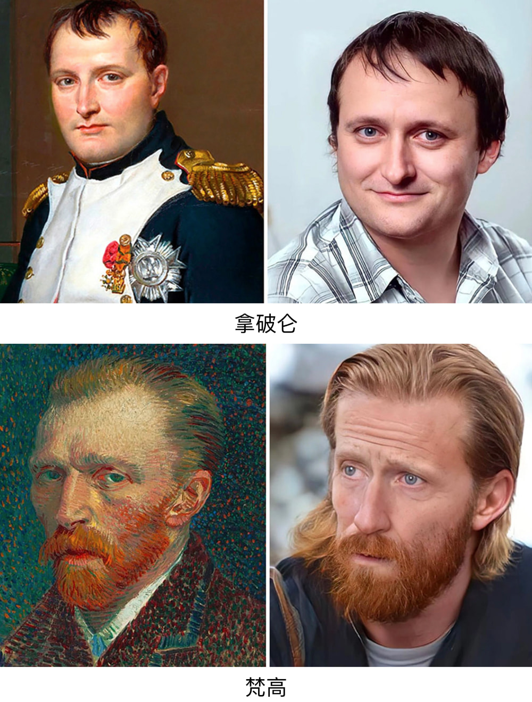
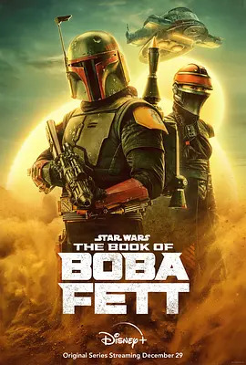
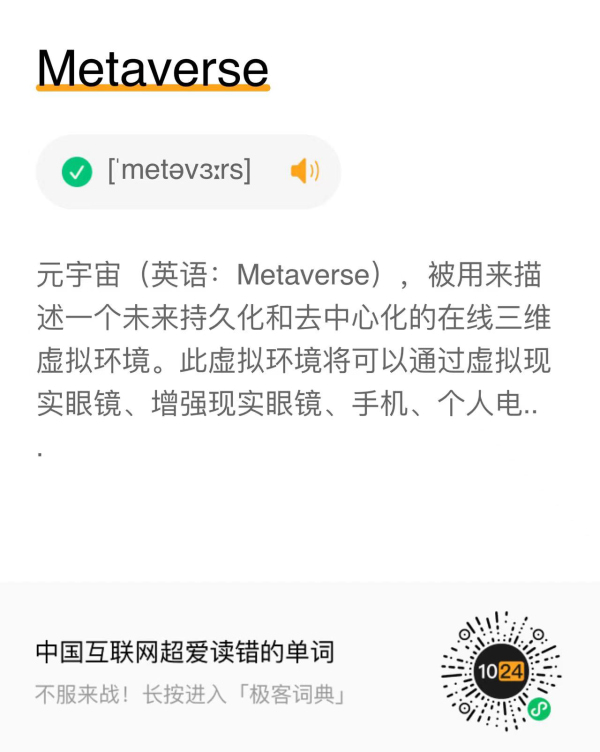

# 酷玩周刊 第 1 期

>发掘一切有趣的数字生活

## 🚀 产品试玩

**[Shottr](https://shottr.cc/)**

小巧好用的免费截图工具，支持滚动截屏、马赛克、标注、OCR、取色等功能，目前仅支持 macOS。

**[Paint](https://paint.withdiagram.com/)**

在网页中复刻了苹果公司第一代 Macintosh 个人电脑的绘画软件 MacPaint。

**[全历史](https://apps.apple.com/cn/app/%E5%85%A8%E5%8E%86%E5%8F%B2/id1387152606)**

关公战秦琼是不可能的，但你可以在「全历史」里面将任何历史人物串联起来，枯燥的历史知识立刻变得生动有趣了。

## 😛 新奇古怪

**[田中达也](https://www.instagram.com/tanaka_tatsuya/)**

田中达也是一个微型摄影艺术家，擅长用日常用品创作微型摄影作品。最近一组用口罩模拟冬奥会冰雪项目的作品，非常有想象力。

**[Hidreley Diao](https://www.instagram.com/hidreley/)**

Hidreley Diao 利用 AI 图片生成技术，将艺术作品中的历史名人还原成现代人的模样。

**[《程序员在家做饭方法指南》](https://github.com/Anduin2017/HowToCook)**

程序员学做饭似乎更喜欢用极客的方法，这是一个 Github 上的开源项目，任何人都可以修改菜谱并提交 Pull request。

## 📚 影音推荐

**[《挽救计划》](https://github.com/Anduin2017/HowToCook)**

小学老师和外星甲壳虫联手拯救太阳系，极具画面感的科幻小说，节奏紧张又不失温情。《火星救援》作者安迪·威尔的又一力作。

**[《人世间》](https://movie.douban.com/subject/35207856/)**

近几年难得的好剧，豆瓣评分8.1。当然评分不太重要，主要是把我看哭了。

**[《波巴·费特之书》](https://movie.douban.com/subject/35291777/)**

曼达洛人、光剑、绝地武士、尤达宝宝、塔图因齐登场，星战迷不可错过的剧集，迪士尼终于把星战玩活了。

## 📝 每周一词*

## ☎️ 关注订阅

- [欢迎投稿](https://wj.qq.com/s2/9741038/c74e/)
- 关注公众号：酷玩一下
- 邮件订阅：[竹白](https://coldplay.zhubai.love/)、[Twitter](https://www.getrevue.co/profile/coldplay-weekly)
- 制作团队：[ThusLab](https://thuscn.com/lab/)

> 带*标注是我们开发的产品，谢谢支持。