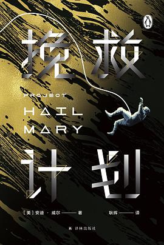

# 酷玩周刊 第 1 期

## 🚀 产品试玩

**Paint**

在网页中复刻了苹果公司第一代 Macintosh 个人电脑的绘画软件 MacPaint。

https://paint.withdiagram.com/

## 📚 影音推荐

**《挽救计划》**

小学老师和外星甲壳虫联手拯救太阳系，极具画面感的科幻小说，节奏紧张又不失温情。《火星救援》作者安迪·威尔的又一力作。

https://book.douban.com/subject/35494160/

## 😛 新奇古怪

## ☎️ 关注催更

- [欢迎投稿]()
- 关注公众号：[酷玩周刊]()
- 微博：[酷玩周刊]()
- Twitter：[@酷玩周刊]()
- 制作团队：[ThusLab](https://thuscn.com/lab/)

