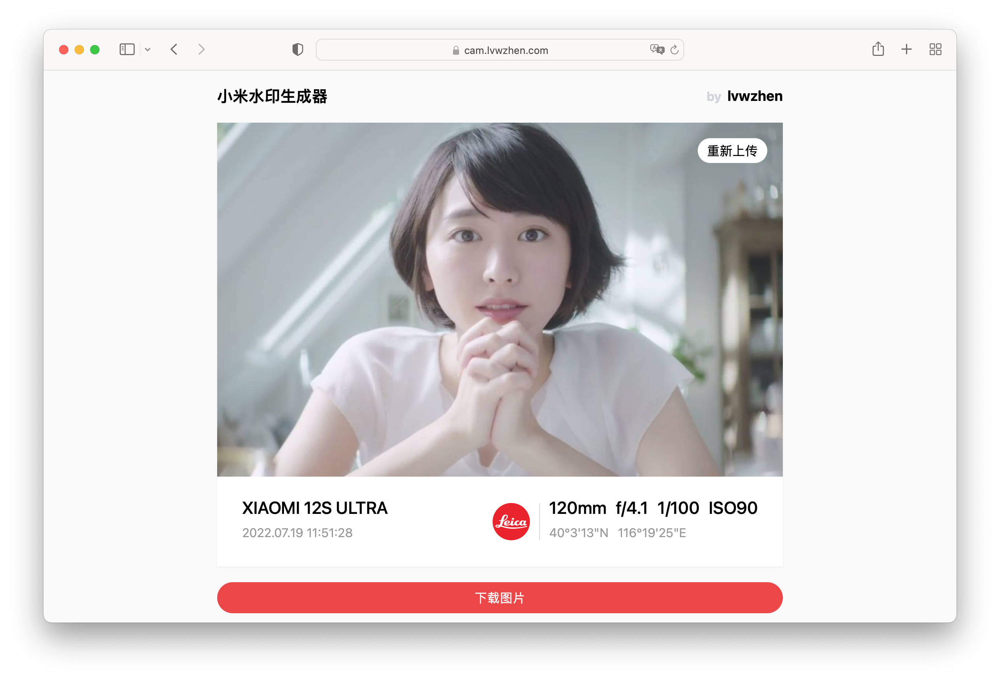
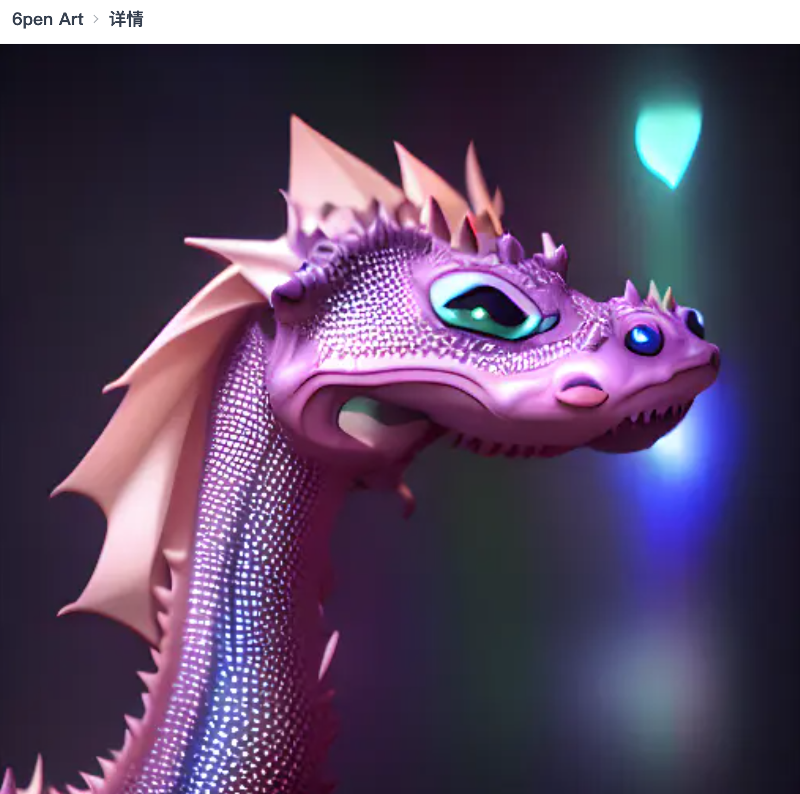
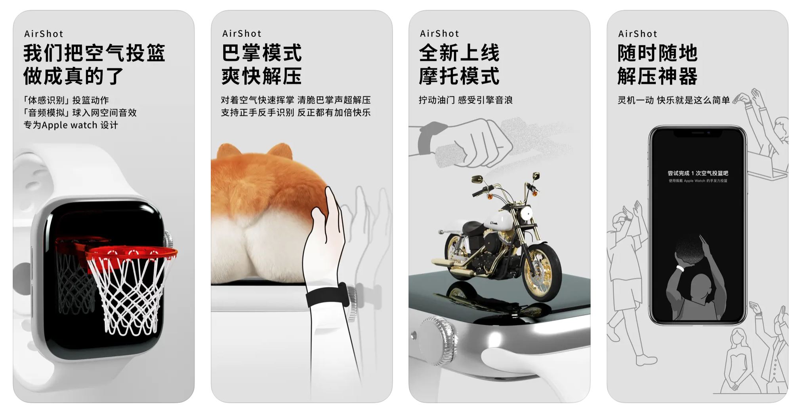
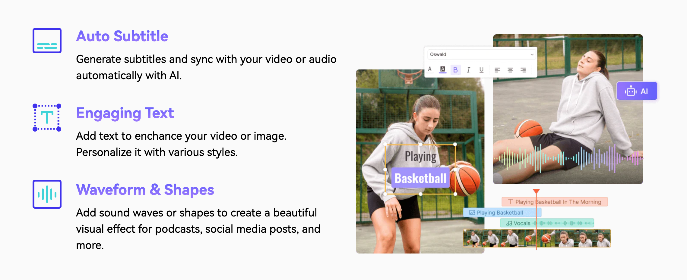
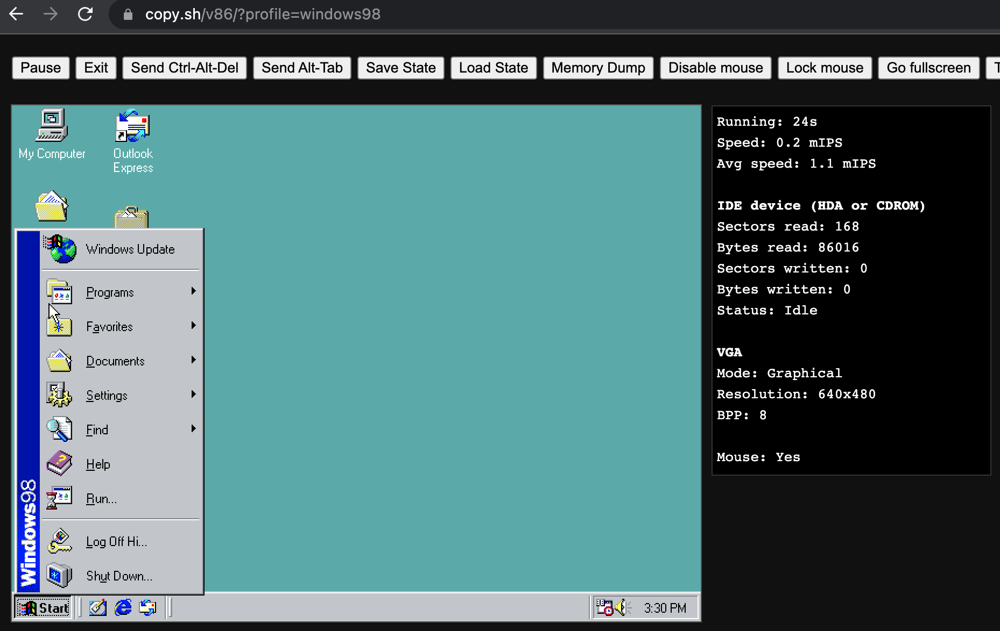
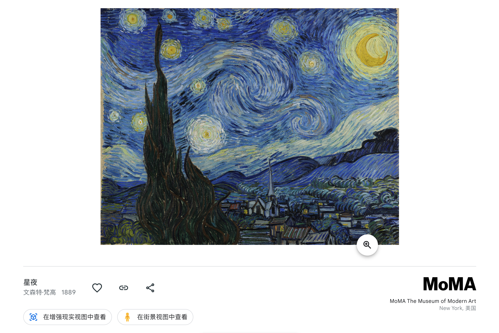
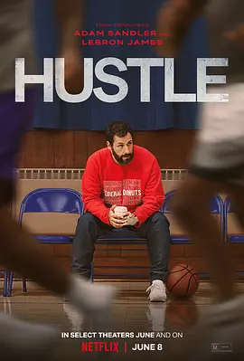
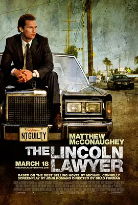
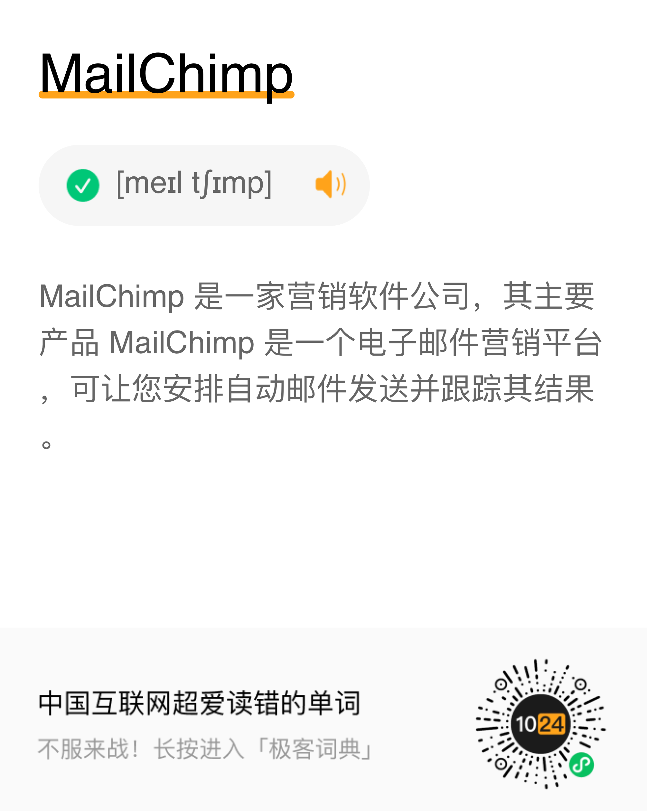

# 酷玩周刊 第 10 期

> 发掘一切有趣的数字生活

## 🚀 产品试玩

**[小米徕卡水印生成器](https://cam.lvwzhen.com/)**

小米花费200万换 logo 的时候，我做了一个小米 logo 生成器。最近小米 12 发布后，小米徕卡水印非常火热，所以又做了一个小米水印生成器，欢迎大家试玩。

**[6pen Art](https://6pen.art/)**

我们之前介绍过很多国外的AI绘画工具，这次是一个国内的绘画工具，叫做6pen Art。支持用中文描述生成绘画艺术作品，版权归生成者所有，目前可以免费使用。

**[空气投篮](https://apps.apple.com/cn/app/airshot-auditoryar/id1625289361)**

用 Apple Watch 体感识别手势，模拟空气投篮的效果。还有摩托车、点蜡烛、拍巴掌的模式可供选择。

**[Media.io](https://www.media.io/)**

一个完全免费的字幕生成器，能够识别视频、音频、图片等格式，支持90多种语言。

## 😛 新奇古怪

**[copy.sh](https://copy.sh/v86/)**

在这个网站里，你可以使用浏览器模拟 windows98、MS-DOS、FreeBSD 等古老的操作系统.

**[Google 博物馆](https://artsandculture.google.com/partner)**

没法出国去看展？不如在 Google 博物馆里看看。收录了梵高、达芬奇、莫奈等许多著名艺术家的作品，不仅能够在电脑上看高清图片，还可以选择AR模式和街景模式查看。

## 📚 影音推荐

**[《必胜球探》](https://movie.douban.com/subject/35073914/)**

落魄球探将一个来自西班牙的篮球天才送往NBA的故事，精彩的体育励志电影。

**[《林肯律师》](https://movie.douban.com/subject/2996790/)**

专开林肯的大律师，客户不是黑帮就是流氓，却秉承“当事人无罪”的信念，马修·麦康纳的诠释亦正亦须，值得一看。

## 📝 每周一词\*

## ☎️ 关注订阅

- [欢迎投稿](https://wj.qq.com/s2/9741038/c74e/)
- [邮件订阅](https://www.getrevue.co/profile/coldplay-weekly)、[Telegram](https://t.me/ColdplayWeekly)、[GitHub](https://github.com/lvwzhen/coldplay-weekly)、[RSS](https://rsshub.app/telegram/channel/ColdplayWeekly)
- 制作团队：[ThusLab](https://thuscn.com/lab/)
- 关注公众号：酷玩一下

> 带\*标注是我们开发的产品，谢谢支持。

