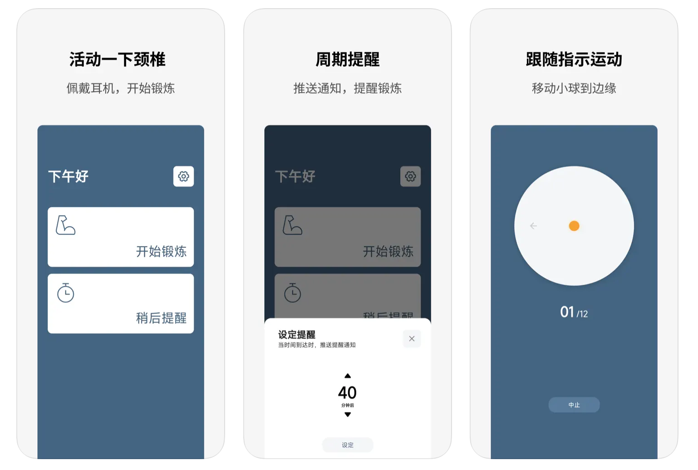
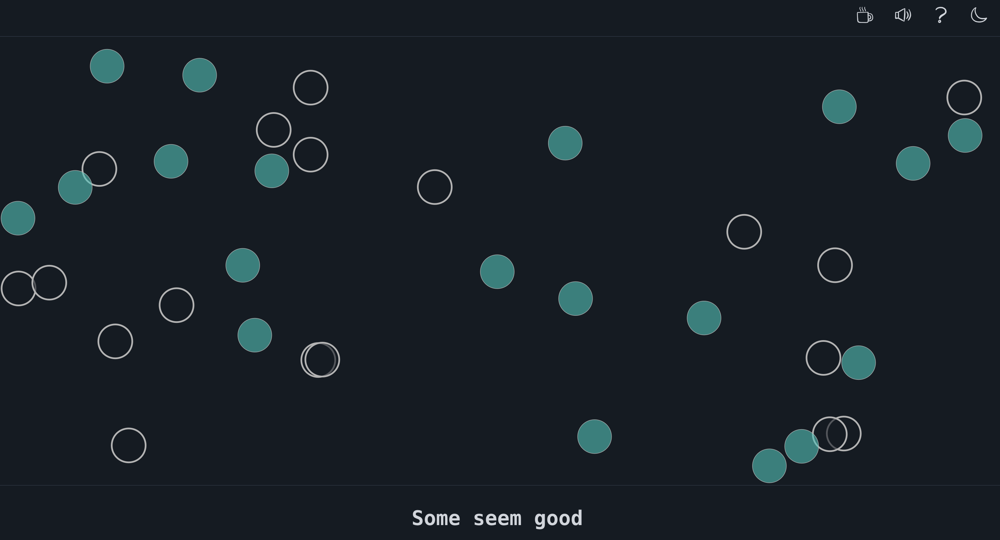

# 酷玩周刊 第 11 期

> 发掘一切有趣的数字生活

## 🚀 产品试玩

**[WantQuotes 据意查句](https://wantquotes.net/)**

由清华大学计算机系自然语言处理实验室开发一套「据意查句」的系统，输入简单的口头语就能查询到对应的诗词、名言、歇后语等，还有对应的释义，平时写文章时非常有用。

**[Gymneck ](https://apps.apple.com/cn/app/gymneck/id1639864504)**

Gymneck 是一款利用耳机运动传感器指导用户进行颈椎运动的 iPhone 应用，仅支持搭配了运动传感器等感应器的设备。

**[BgSub - 人工智能抠图工具](https://bgsub.cn/)**

利用人工智能技术进行抠图的在线工具，操作简单，还支持更换背景、调色、滤镜等功能，并承诺不会上传图片信息。

**[中文播客榜](https://xyzrank.com/#/)**

搜集整理了中文播客榜单，可以通过播放量、评论数、分类等找到自己喜欢的播客节目。

## 😛 新奇古怪

**[黑洞的声音](https://twitter.com/NASAExoplanets/status/1561442514078314496)**

一般都认为宇宙太空是真空的所以没有声音，但其实上星系中有很多气体可以传播声音。NASA 将收集到的声音放大处理，可以听到一个来自黑洞的声音。

**[微软 3D emoji 表情包](https://github.com/microsoft/fluentui-emoji)**

微软开源了最新的 Fluent Emoji 表情包，有3D、扁平化、黑白等多种风格可选，提供PNG和SVG高清原图下载。

**[飞行时刻 - 大疆在线无人机体验](https://start.dji.com/)**

在浏览器中模拟控制无人机，准备买无人机的朋友可以先体验试试。

**[This is a thing](https://www.thisisathing.io/)**

这是一个冥想网站，带上耳机，有音乐和动画可以帮助引导冥想练习。

**[iPhone 设计生成器](https://neal.fun/design-the-next-iphone/)**

你还在苦苦等待 iPhone 14的发布么？别等了，自己设计一款不香么。喜欢拍照？给他加上3组摄像头。有复古情怀？再来一个拨号器。痴迷高科技，加个螺旋桨吧。

## 📝 每周一词\*

## 🧪 酷玩实验室

## ☎️ 关注订阅

- [欢迎投稿](https://wj.qq.com/s2/9741038/c74e/)
- [邮件订阅](https://www.getrevue.co/profile/coldplay-weekly)、[Telegram](https://t.me/ColdplayWeekly)、[GitHub](https://github.com/lvwzhen/coldplay-weekly)、[RSS](https://rsshub.app/telegram/channel/ColdplayWeekly)
- 制作团队：[ThusLab](https://thuscn.com/lab/)
- 关注公众号：酷玩一下

> 带\*标注是我们开发的产品，谢谢支持。

