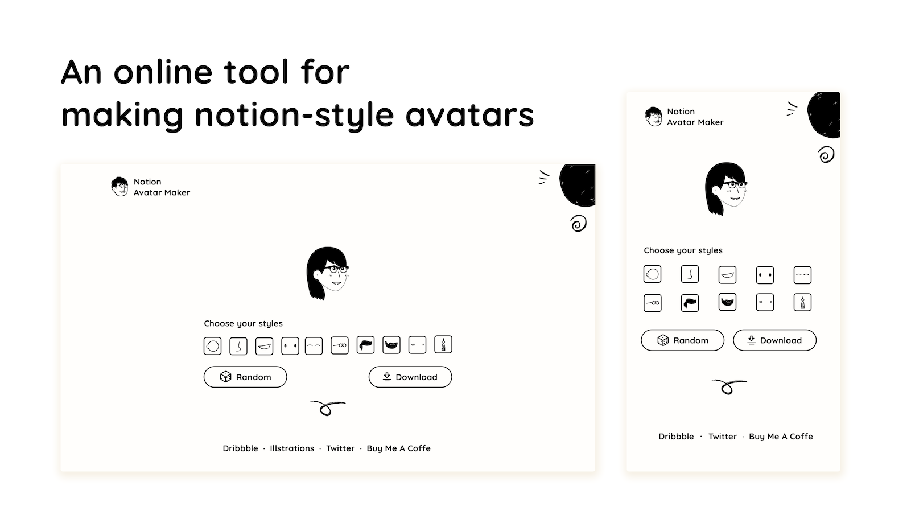
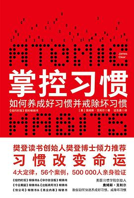
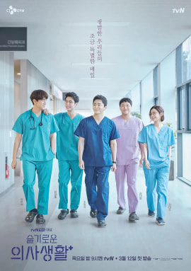

# 酷玩周刊 第 2 期

>发掘一切有趣的数字生活

## 🚀 产品试玩

**[谜底黑胶 - 黑胶唱片小组件](https://apps.apple.com/cn/app/md-vinyl-music-widgets/id1606306441)**

**[DAMA - 图片隐私智能打码](https://apps.apple.com/cn/app/id1534690075)**

**[Notion 风格头像制作](https://notion-avatar.vercel.app/zh)**

**[Tailwind CSS Color Shades Generator](https://uicolors.app/create)**

## 😛 新奇古怪

**[你用的这些 App，都来自乌克兰](https://mp.weixin.qq.com/s/mgCpGu1YQH-KlKv7BPesZQ)**

**[猝死预防指南](https://sspai.com/post/71678?utm_source=twitter&utm_medium=social)**

**[开源字体：未来荧黑](https://github.com/welai/glow-sans)**

## 📚 影音推荐

**[欧洲之门：乌克兰2000年史](https://book.douban.com/subject/26983915/)**

**[《掌控习惯》](https://book.douban.com/subject/34326931/)**

如何培养好习惯？作者提出了4个定律：让它显而易见、让它具有吸引力、让它简单易行、让它令人愉悦。我正在用它执行每天锻炼的计划，你也可以试试。

**[《机智医生生活》](https://movie.douban.com/subject/33464863/)**

《请回答1988》的导演申元浩+编剧李祐汀，这个组合真的是强，强烈推荐看看！豆瓣评分9.5，是以医院为背景，讲述了平凡的医生、护士及患者们的故事，以及五位医生好友间超过20年的情谊。

## 📝 每周一词*

Grammarly

## ☎️ 关注订阅

- [欢迎投稿](https://wj.qq.com/s2/9741038/c74e/)
- [邮件订阅](https://www.getrevue.co/profile/coldplay-weekly)、[Telegram](https://t.me/ColdplayWeekly)、[GitHub](https://github.com/lvwzhen/coldplay-weekly)
- 制作团队：[ThusLab](https://thuscn.com/lab/)
- 关注公众号：酷玩一下

> 带*标注是我们开发的产品，谢谢支持。