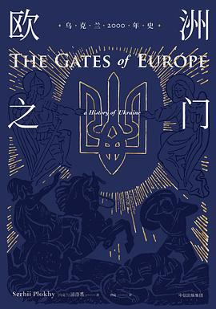

# 酷玩周刊 第 2 期

>发掘一切有趣的数字生活

## 🚀 产品试玩

**[谜底黑胶 - 黑胶唱片小组件](https://apps.apple.com/cn/app/md-vinyl-music-widgets/id1606306441)**

在小组件中用黑胶唱片的效果展示正在播放的音乐，目前支持 Apple Music，后续版本会支持 Spotify 等应用。

**[DAMA - 图片隐私智能打码](https://apps.apple.com/cn/app/id1534690075)**

DAMA 是一个非常好用的图片打码应用，最新的版本添加了「压缩相似颜色」的功能，能够去掉部分截图中隐藏的跟踪水印。

**[Notion 风格头像制作](https://notion-avatar.vercel.app/zh)**

如果你也喜欢 Notion 风格的手绘头像，可以用这个生成器来制作属于自己的头像。

**[Tailwind CSS Color Shades Generator](https://uicolors.app/create)**

 一键生成设计主题配色，还可以直接复制 Tailwind CSS 配置代码。

## 😛 新奇古怪

**[你用的这些 App，都来自乌克兰](https://mp.weixin.qq.com/s/mgCpGu1YQH-KlKv7BPesZQ)**

GitLab、Setapp、CleanMyMac、Grammarly，原来这些耳熟能详的 App 都是来自乌克兰。如今乌克兰陷入争端，愿世界和平，peace and love。

**[猝死预防指南](https://sspai.com/post/71678?utm_source=twitter&utm_medium=social)**

上周一起员工猝死的新闻令人痛心，拼命搬砖的同时，关注自己的健康状态至关重要。

**[Apple 苹果春季发布会](https://www.apple.com.cn/apple-events/)**

Apple 苹果春季发布会将于北京时间3月9日凌晨2点召开，预计会发布新的 iPad Air、Mac mini 和 iPhone SE 等。

这里有[发布会主题壁纸](https://www.aliyundrive.com/s/fvkHm3nqBQ2)可供下载。

## 📚 影音推荐

**[《欧洲之门：乌克兰2000年史》](https://book.douban.com/subject/26983915/)**

乌克兰作为欧洲与亚洲、东方与西方的枢纽，经历了定居和游牧、东正教与天主教，在不同文明的碰撞下，造成了独特的边缘身份。乌克兰和俄罗斯有何渊源和恩怨？我们可以在这本历史书中略窥一斑。

**[《掌控习惯》](https://book.douban.com/subject/34326931/)**

如何培养好习惯？作者提出了4个定律：让它显而易见、让它具有吸引力、让它简单易行、让它令人愉悦。我正在用它执行每天锻炼的计划，你也可以试试。

**[《机智医生生活》](https://movie.douban.com/subject/33464863/)**

《请回答1988》的导演申元浩+编剧李祐汀，强烈推荐！以医院为背景，讲述了平凡的医生、护士及患者们的故事，以及五位医生好友间超过20年的情谊。

**[《侠探杰克》](https://movie.douban.com/subject/30378897/)**

杰克·雷彻是一个不受束缚，享受孤独的浪子神探，福尔摩斯的智商配上施瓦辛格的体型，再加上拳拳到肉的动作戏，是一部优秀合格的动作爽剧。

## 📝 每周一词*

## ☎️ 关注订阅

- [欢迎投稿](https://wj.qq.com/s2/9741038/c74e/)
- [邮件订阅](https://www.getrevue.co/profile/coldplay-weekly)、[Telegram](https://t.me/ColdplayWeekly)、[GitHub](https://github.com/lvwzhen/coldplay-weekly)
- 制作团队：[ThusLab](https://thuscn.com/lab/)
- 关注公众号：酷玩一下

> 带*标注是我们开发的产品，谢谢支持。