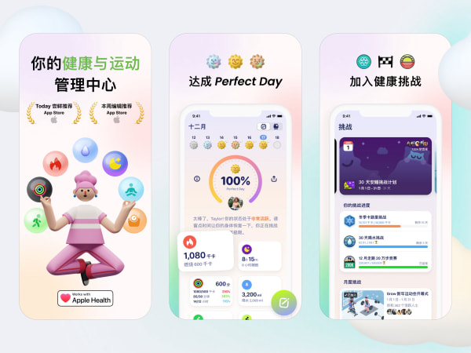
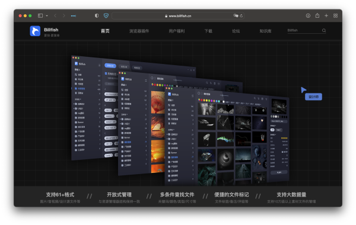

# 酷玩周刊 第 3 期

>发掘一切有趣的数字生活

## 🚀 产品试玩

**[Grow](https://apps.apple.com/app/id1560604814)**

Grow 是一个自动化健康管理和习惯养成工具，它能够连接苹果健康的数据自动打卡，并且可以参加挑战获得奖章，让习惯养成更有趣。

**[HapiGo](https://hapigo.com/)**

HapiGo 是 macOS 上免费的快捷启动器，打开应用、预览文件、剪切板、快速翻译都不在话下，还支持许多快捷键操作，可以替代自带的 Spotlight。

 

**[Billfish](https://www.billfish.cn/)**

Billfish 是一款免费的素材管理工具，支持图片、音频、视频、源文件等多种格式，文件搜索功能也很强大，适合设计师朋友使用。

 

**[Huemint](https://huemint.com/)**

利用机器学习自动生成主题配色，可以即时预览效果，还支持上传图片生成对应配色。

## 😛 新奇古怪

**[Apple 召开春季发布会](https://mp.weixin.qq.com/s/qKJh-eVHAxw3Sp4r2534uQ)**

这周苹果发布了新款的 iPhone SE、iPad Air、Mac Studio、Studio Display 和绿色的iPhone 13、13 Pro。

**[杭州购房指南](https://github.com/zkqiang/hangzhou-house-guide)**

GitHub 上经常有许多有趣的仓库，一位程序员将自己买房的经历整理出的杭州购房指南，从政策、购房、规划、板块等多个方面进行分析，思路清晰很有参考意义。

## 📚 影音推荐

**[《芬奇》](https://movie.douban.com/subject/26897885/)**

一人、一机、一狗，汤姆汉克斯又一次一个人演绎了一部末日版的荒野求生，推荐观看。

**[《我们为什么要睡觉？》](https://book.douban.com/subject/35332778/)**

好好睡觉现在已经成为很多人的奢侈品，至于睡觉为什么很重要？如何睡好觉？作者通过许多科学实验和社会调查揭示睡觉对人的影响，给出了健康睡眠的一些方法，睡不好觉的朋友可以一试。

**[《掌控：开启不疲惫、不焦虑的人生》](https://book.douban.com/subject/30273559/)**

最近有很多流行的健身方法和减肥攻略，可有些人越健身越焦虑，时常会忘掉健身的初衷。这本书从运动、饮食、恢复、心态等多个方面入手，破除迷思，讲述保持精力的方法。

## 📝 每周一词*

## ☎️ 关注订阅

- [欢迎投稿](https://wj.qq.com/s2/9741038/c74e/)
- [邮件订阅](https://www.getrevue.co/profile/coldplay-weekly)、[Telegram](https://t.me/ColdplayWeekly)、[GitHub](https://github.com/lvwzhen/coldplay-weekly)
- 制作团队：[ThusLab](https://thuscn.com/lab/)
- 关注公众号：酷玩一下

> 带*标注是我们开发的产品，谢谢支持。