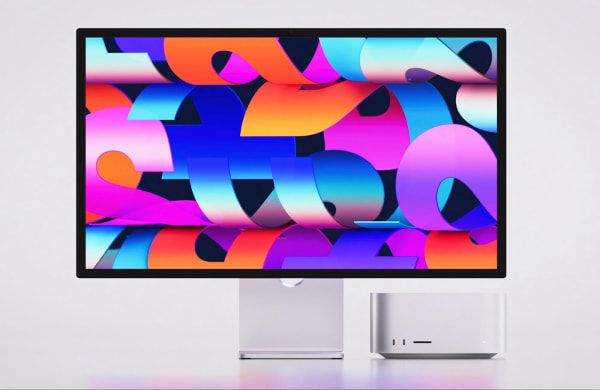
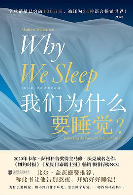

# 酷玩周刊 第 3 期

>发掘一切有趣的数字生活

## 🚀 产品试玩

**[Grow](https://apps.apple.com/app/id1560604814)**

**[Hapigo](https://hapigo.com/)**

**[Blackbox](https://blckbx.ai)**

**[Huemint](https://huemint.com/)**

## 😛 新奇古怪

**[Apple 召开春季发布会](https://mp.weixin.qq.com/s/qKJh-eVHAxw3Sp4r2534uQ)**

这周苹果发布了新款的 iPhone SE、iPad Air、Mac Studio、Studio Display 和绿色的iPhone 13、13 Pro。

**[杭州购房指南](https://github.com/zkqiang/hangzhou-house-guide)**

## 📚 影音推荐

**[《芬奇》](https://movie.douban.com/subject/26897885/)**

**[《我们为什么要睡觉？》](https://book.douban.com/subject/35332778/)**

**[《掌控：开启不疲惫、不焦虑的人生》](https://book.douban.com/subject/30273559/)**

## 📝 每周一词*

## ☎️ 关注订阅

- [欢迎投稿](https://wj.qq.com/s2/9741038/c74e/)
- [邮件订阅](https://www.getrevue.co/profile/coldplay-weekly)、[Telegram](https://t.me/ColdplayWeekly)、[GitHub](https://github.com/lvwzhen/coldplay-weekly)
- 制作团队：[ThusLab](https://thuscn.com/lab/)
- 关注公众号：酷玩一下

> 带*标注是我们开发的产品，谢谢支持。