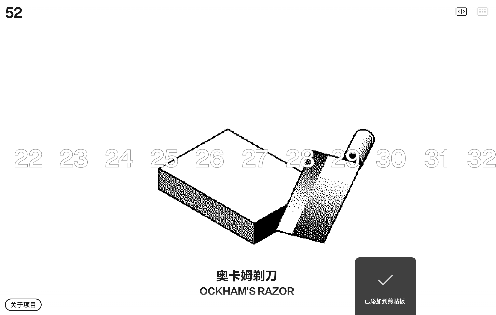
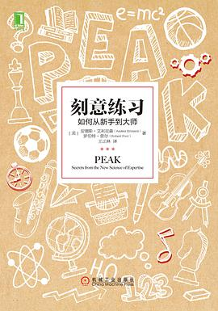

# 酷玩周刊 第 4 期

>发掘一切有趣的数字生活

## 🚀 产品试玩

**[Magic Eraser](https://www.magiceraser.io/)**

顾名思义魔法橡皮擦，这是一个超级好用的P图工具，无需注册，简单拖动鼠标就能删除照片中的物品，并利用AI技术补全图片。

**[MenubarX](https://menubarx.app)**

MenubarX 是一款 macOS 的菜单栏浏览器，你可以把邮箱、翻译、微博、B站等网页固定在菜单栏中，大大提高工作时摸鱼的效率😂。

**[YaoYao - 跳绳](https://apps.apple.com/cn/app/id1485959492)**

YaoYao 是我用了很久的跳绳计数 App，之前支持手机和手表计数，最新的一个版本利用AirPods中的运动传感器添加了耳机模式，仅需佩戴耳机就可跳绳计数了。

**[火山翻译](https://translate.volcengine.com/translate)**

火山翻译是字节跳动出品的一款翻译工具，比较好玩的是它提供了一个翻译成「文言文」的模式。

## 😛 新奇古怪

**[physicsfun](https://www.instagram.com/physicsfun/)**

physicsfun 这个账号每天会发布一些小玩具，透过视频展示一些有趣的物理现象。

**[52 个设计原则](https://rpdc.xiaohongshu.com/52-design-principles)**

小红书产品设计中心推出的设计原则，每篇原则中有简介、案例和相关阅读，推荐给产品设计的同学。

## 📚 影音推荐

**[蜘蛛侠：英雄无归](https://movie.douban.com/subject/26933210/)**

蜘蛛侠请奇异博士施展魔法解决身份问题，却意外打开多元宇宙，3版蜘蛛侠中的角色陆续登场情怀十足。

**[刻意练习](https://book.douban.com/subject/26895993/)**

一万小时定律大家肯定听说过，不过它的原作者艾利克森在《刻意练习》中指出，成为一名专家时间并非最重要的因素，了解刻意练习的方法更为重要。

## 📝 每周一词*

## ☎️ 关注订阅

- [欢迎投稿](https://wj.qq.com/s2/9741038/c74e/)
- [邮件订阅](https://www.getrevue.co/profile/coldplay-weekly)、[Telegram](https://t.me/ColdplayWeekly)、[GitHub](https://github.com/lvwzhen/coldplay-weekly)、[RSS](https://rsshub.app/telegram/channel/ColdplayWeekly)
- 制作团队：[ThusLab](https://thuscn.com/lab/)
- 关注公众号：酷玩一下

> 带*标注是我们开发的产品，谢谢支持。