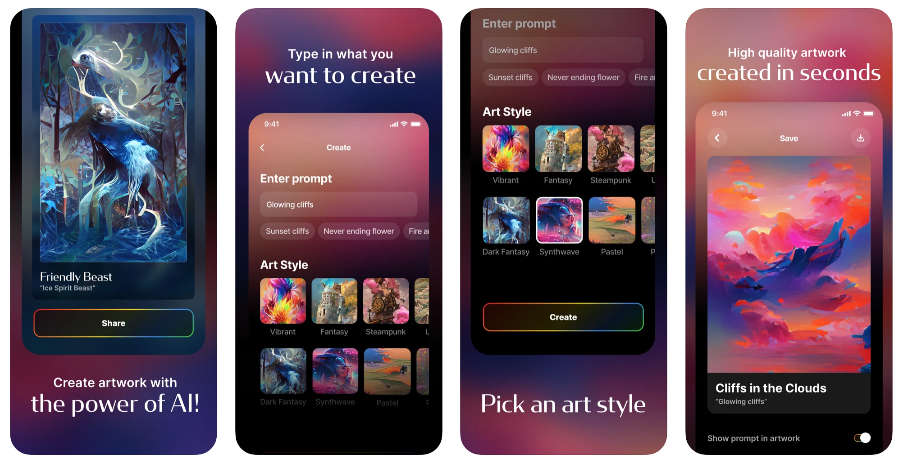
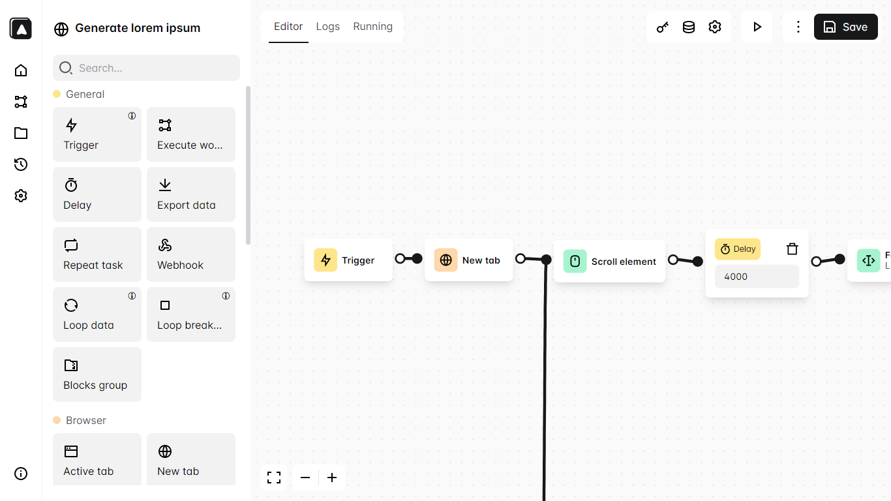
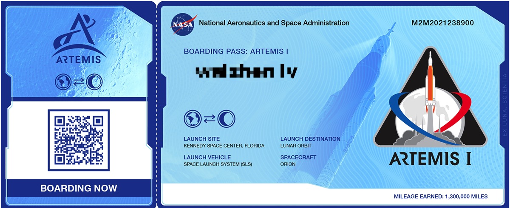

# 酷玩周刊 第 5 期

>发掘一切有趣的数字生活

## 🚀 产品试玩

**[Dream by WOMBO](https://apps.apple.com/us/app/dream-by-wombo/id1586366816)**

基于机器学习的艺术图片处理器，用户上传普通图片后，可选择不同艺术风格，生成效果非常不错，App目前免费。

**[Automa](https://www.automa.site/)**

Automa 是一个浏览器扩展程序，通过简单的拖拽模块就可以实现自动填表、执行重复性任务、截图，读取网站数据等自动化任务。

**[Sampld](https://open.sampld.app/)**

免费版权的音频网站，有各种钢琴配乐、白噪音、冥想音乐可供选择。

## 😛 新奇古怪

**[把你的名字送到月球上去](https://www.nasa.gov/send-your-name-with-artemis/)**

在 NASA 这个网页中登记名字信息，登记的名字会由Artemis 宇航飞船带到太空中环绕月球旅行。

**[lofi.co](https://lofi.co/)**

非常棒的 Lo-Fi 音乐电台，不仅能选择咖啡馆、森林、海边等不同场景，还能添加雨声、交通声、键盘声等音效，可以用作工作时的白噪音。

**[纪妖](http://www.cbaigui.com/)**

（原名知妖）致力于收集、整理、介绍、分享古人文献中的“妖怪”，“妖怪”的长相、描述和经历都有详细介绍。比如《山海经》里的各种“妖怪”都有介绍。

## 📚 影音推荐

**[Random 001](https://open.spotify.com/playlist/3JmUsJM5RmsBfCkpqZVaA2?si=9fed31bd1f9f4e17)**

整理了一个 「Random」的歌单，分享每周听到的好歌。

**[《国王排名》](https://movie.douban.com/subject/34927946/)**

又聋又哑，毫无力气的波吉王子居然想成为最伟大的国王，跟《国王排名》的波吉王子一起冒险吧。

**[播客：姜思达](https://www.xiaoyuzhoufm.com/podcast/5fe489dadee9c1e16dbe7524)**

很难想象一个单人瞎聊的播客能够在华语播客榜上排名前五，有可能这就是姜思达的个人魅力吧。

## 📝 每周一词*

## ☎️ 关注订阅

- [欢迎投稿](https://wj.qq.com/s2/9741038/c74e/)
- [邮件订阅](https://www.getrevue.co/profile/coldplay-weekly)、[Telegram](https://t.me/ColdplayWeekly)、[GitHub](https://github.com/lvwzhen/coldplay-weekly)、[RSS](https://rsshub.app/telegram/channel/ColdplayWeekly)
- 制作团队：[ThusLab](https://thuscn.com/lab/)
- 关注公众号：酷玩一下

> 带*标注是我们开发的产品，谢谢支持。