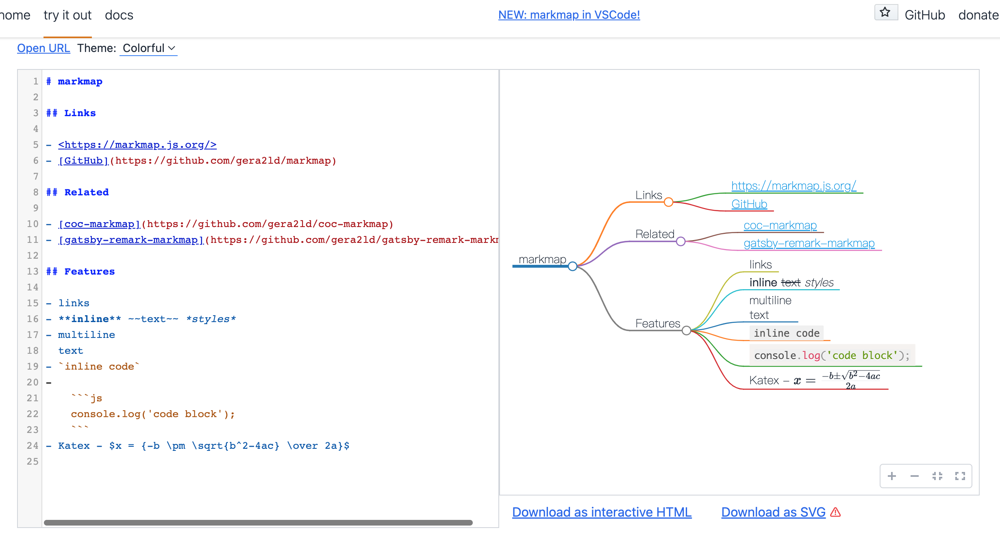

# 酷玩周刊 第 6 期

>发掘一切有趣的数字生活

## 🚀 产品试玩

**[上海抗疫互助](http://shanghai-sos.com/)**

最近上海疫情愈加严重，有网友自制了一个抗疫互助平台，可以自行发布求助信息和提供物资帮助，希望能帮到上海的朋友。

**[Qwerty Learner](https://qwerty.kaiyi.cool/)**

如果你最近正在学习英语，可以试一下 Qwerty Learner，通过它可以将背单词和键盘输入的肌肉记忆相结合，另外还有4级、6级、托福、雅思、编程等多种词库可供选择。

**[腾讯智能创作助手](https://effidit.qq.com/)**

腾讯AI实验室最近推出了「智能创作助手」，利用 AI 技术提升写作者的写作效率和创作体验，有智能纠错、文本补全、文本润色等功能，相当于中文本的 Copilot，大家可以试下效果。

**[电子包浆 图片赛博做旧](https://lab.magiconch.com/patina/)**

我见过很多利用AI来把模糊图片变清晰的项目，但是把清晰的图片变模糊，还是第一次见。这个电子包浆图片变旧生成器，能够模拟图片多次保存后模糊不清的效果，还会自动给图片加上各种水印，非常搞笑。

**[markmap](https://markmap.js.org/repl/)**

markmap 是将 markdown 和思维导图结合起来的工具，它能够将 markdown 文本转换为思维导图，还有 VSCode 插件可供使用。

**[telesqope](https://telesqope.co/)**

疫情已经将视频会议变成了常态，telesqope 可以在用户视频通话时提醒表情、坐姿、语速等，辅助用户提高视频通话的状态。

## 😛 新奇古怪

**[书格](https://new.shuge.org/)**

书格是一个自由开放的在线古籍图书馆，它收集了许多中国古籍、绘画、书法等资源，并可供免费下载，是学习古籍的好地方。

**[齊伋體](https://github.com/LingDong-/qiji-font)**

齊伋體是一个利用深度学习技术扫描古籍生成的字体，里面有生成字体的流程和脚本，目前字体开源，可供免费使用。

**[武汉首家苹果 Apple Store 零售店即将开业](https://www.apple.com.cn/retail/wuhan/)**

## 📚 影音推荐

**[Random 002](https://open.spotify.com/playlist/2A5Q6Q6yercpuwa6rDSyT5?si=0f327ee8030f449b)**

每周歌单 Random 002 已更新。

**[月光骑士](https://movie.douban.com/subject/26358318/)**

白天是博物馆礼品店员，晚上化身月光骑士，最近一部极具暗黑气质的漫威剧集。

## 📝 每周一词*

## ☎️ 关注订阅

- [欢迎投稿](https://wj.qq.com/s2/9741038/c74e/)
- [邮件订阅](https://www.getrevue.co/profile/coldplay-weekly)、[Telegram](https://t.me/ColdplayWeekly)、[GitHub](https://github.com/lvwzhen/coldplay-weekly)、[RSS](https://rsshub.app/telegram/channel/ColdplayWeekly)
- 制作团队：[ThusLab](https://thuscn.com/lab/)
- 关注公众号：酷玩一下

> 带*标注是我们开发的产品，谢谢支持。