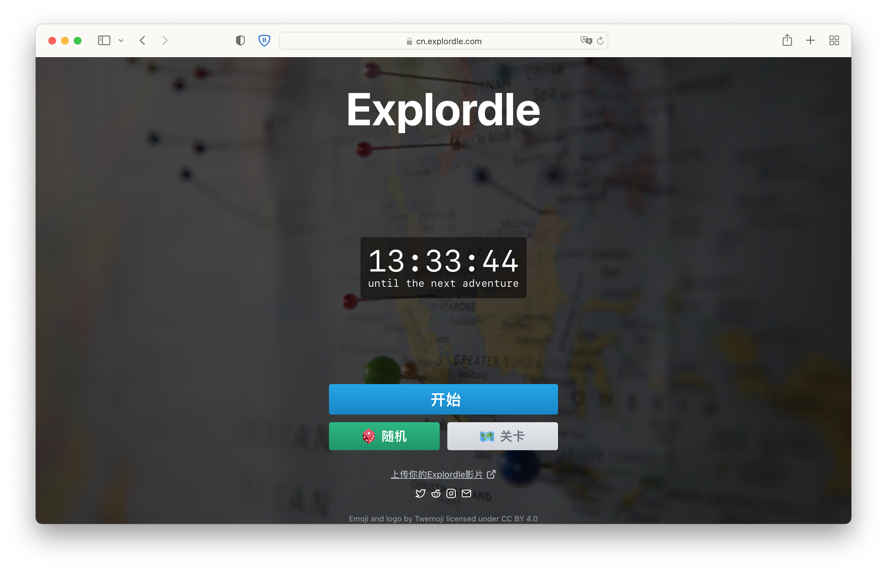
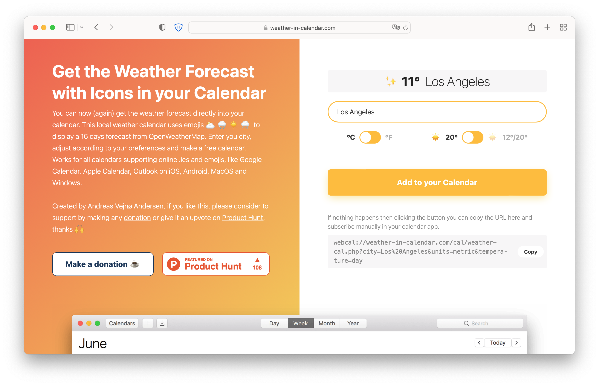
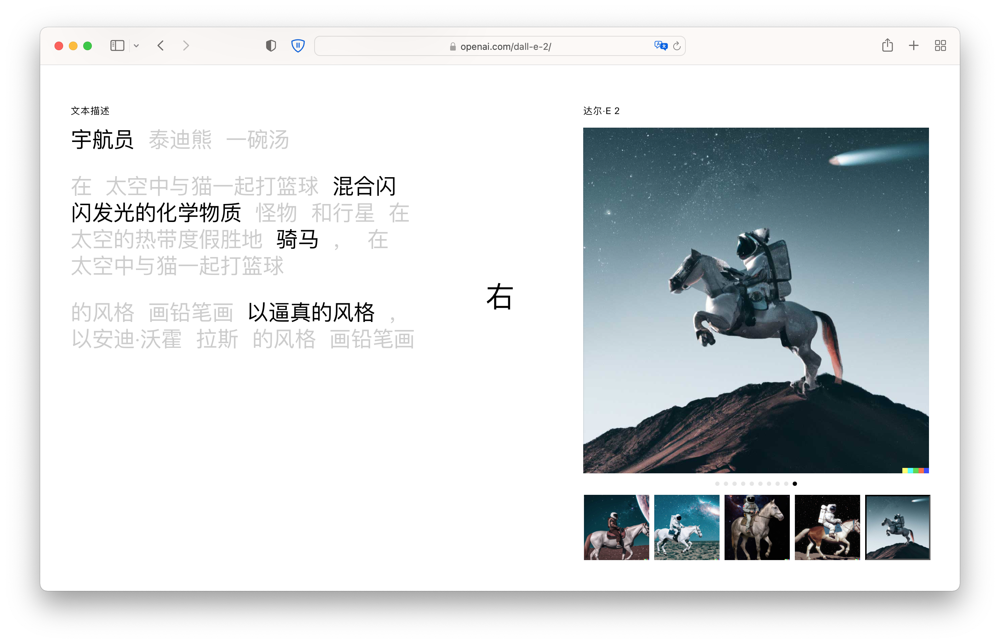
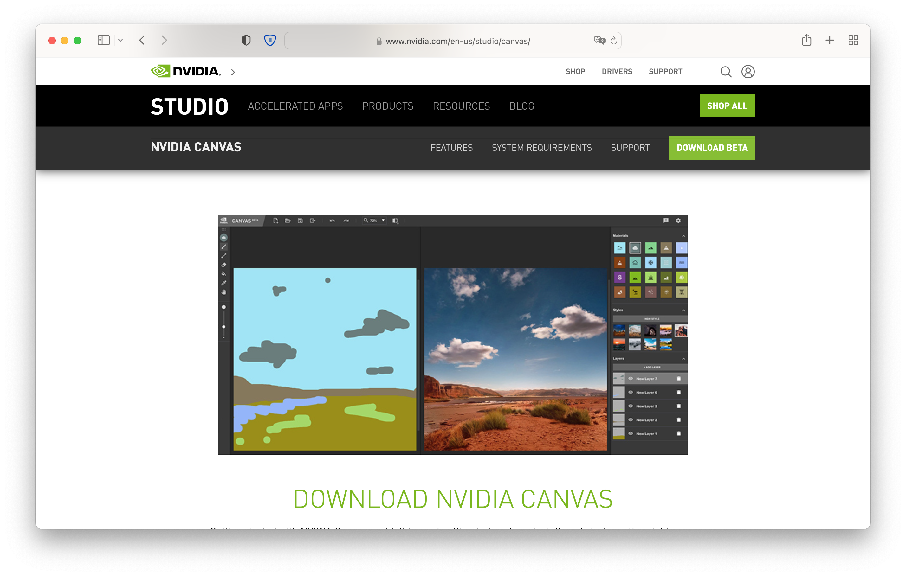
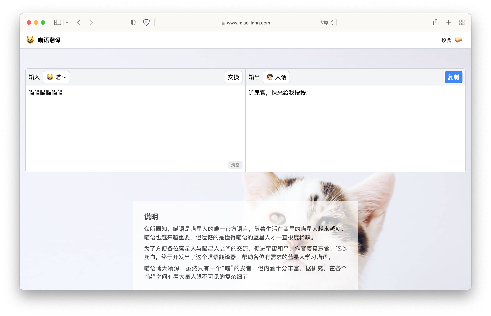
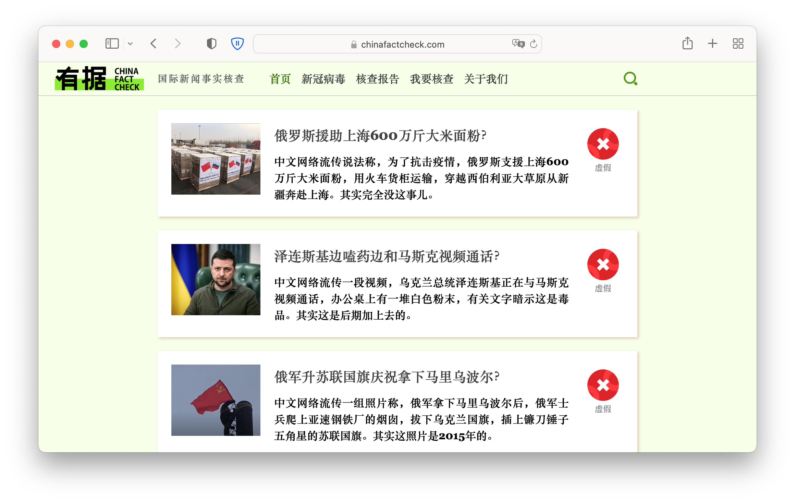
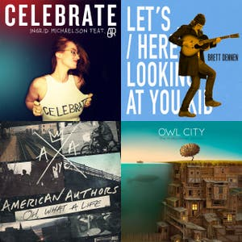

# 酷玩周刊 第 8 期

>发掘一切有趣的数字生活

## 🚀 产品试玩

**[Explordle](https://www.explordle.com/)**

看视频猜地点，在 Explordle 中观看一段视频，通过路标、建筑、语言等元素猜出视频的拍摄地点。在目前不能出国旅游的特殊时期，Explordle 是一个有趣且能够了解不同风土人情的游戏。

**[Weather in your Calendar](https://weather-in-calendar.com/)**

新增一个日历订阅链接，就可以用最简单的方式查看未来14天的天气。

**[DALL·E 2](https://openai.com/dall-e-2/)**

通过自然语言的描述生成逼真的艺术图片，DALL·E 2 是 openAI 的一个非常惊艳的人工智能系统，不过目前还在测试阶段，可以提交一下 waitlist 等候测试。

## 😛 新奇古怪

**[NVIDIA CANVAS](https://www.nvidia.com/en-us/studio/canvas/)**

大批设计师正瑟瑟发抖，设计师的工作极有可能会在未来被AI人工智能所取代。NVIDIA 最近发布的 NVIDIA CANVAS 是一个 AI 绘画助手，只需要涂上几笔就能生成逼真的风景画，下载测试版软件即可试玩。

**[诗三百·人工智能在线诗歌写作平台](https://www.nvidia.com/en-us/studio/canvas/)**

不会写诗写对联？让AI人工智能来吧。输入关键字，立马给你生成七绝、藏头诗、对联各种组合，可以一试。

**[喵语翻译](https://www.miao-lang.com/)**

听不懂你家的猫在说什么？快来试试「喵语翻译」吧，促进人猫和谐相处就靠它了。

**[家庭应急物资囤货清单](https://mp.weixin.qq.com/s/W8x77qi-dJToyTXYoRHGPg)**

一份详细的「家庭应急物资囤货清单」，从食物、日用品、药品、急救工具等多个方面提供参考。

**[有据](https://chinafactcheck.com/)**

有据是一个于对中文国际资讯进行事实核查的网站，对许多热门新闻进行了事实核查求证，用作破除谣言非常有帮助。

**[国家标准全文公开系统](http://openstd.samr.gov.cn/bzgk/gb/index)**

这里提供国家标准文件的全文公开预览和下载，收录了大部分的国家标准文件。

## 📚 影音推荐

**[Random 003](https://open.spotify.com/playlist/4NM1XgBCns9fiYW26mXwgB?si=7c3dc1e1df904bdd)**

## 📝 每周一词*

## ☎️ 关注订阅

- [欢迎投稿](https://wj.qq.com/s2/9741038/c74e/)
- [邮件订阅](https://www.getrevue.co/profile/coldplay-weekly)、[Telegram](https://t.me/ColdplayWeekly)、[GitHub](https://github.com/lvwzhen/coldplay-weekly)、[RSS](https://rsshub.app/telegram/channel/ColdplayWeekly)
- 制作团队：[ThusLab](https://thuscn.com/lab/)
- 关注公众号：酷玩一下

> 带*标注是我们开发的产品，谢谢支持。