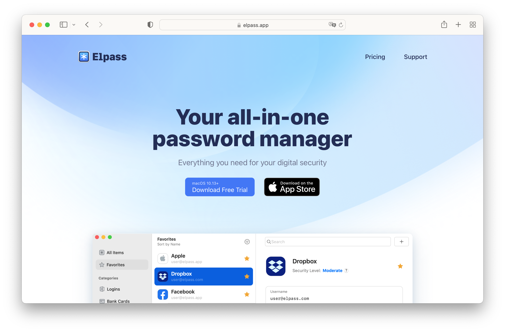
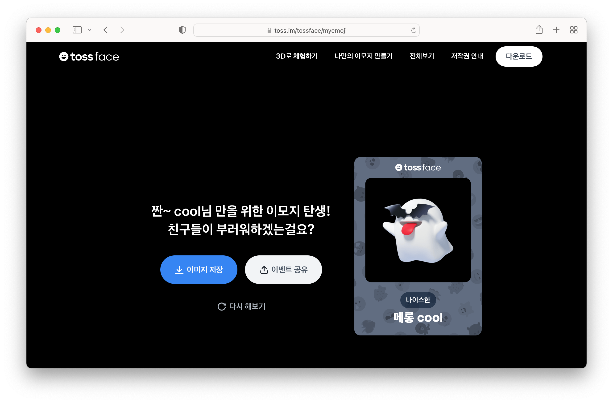
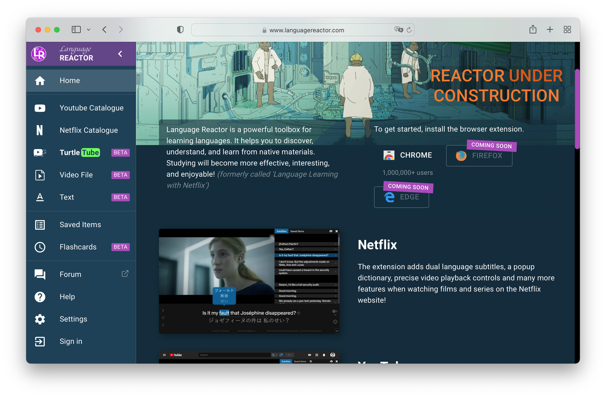
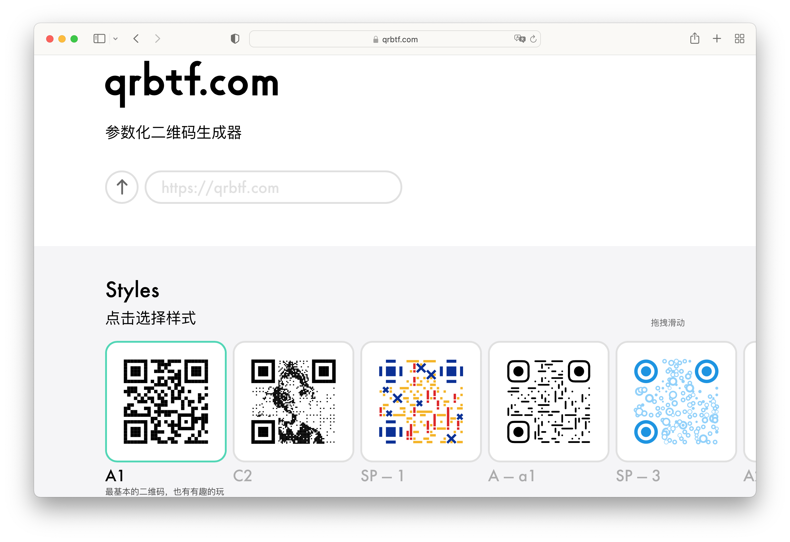
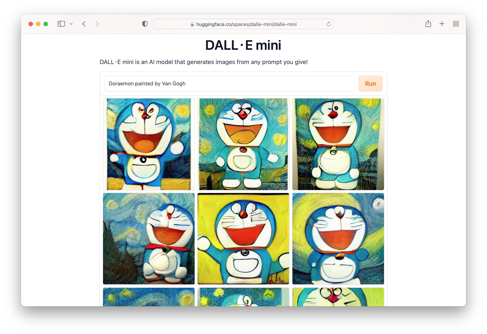
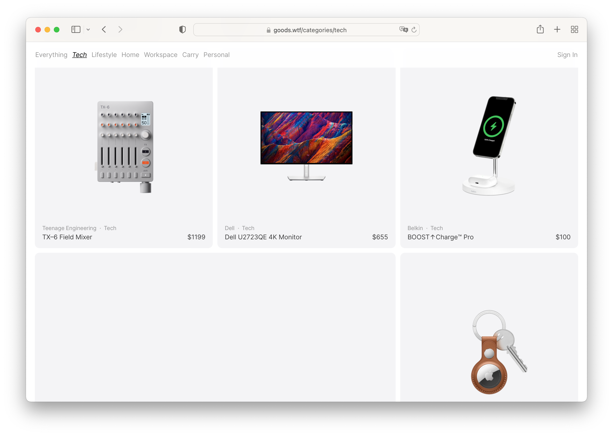
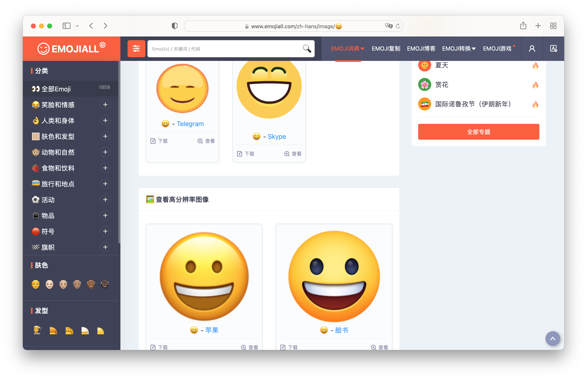
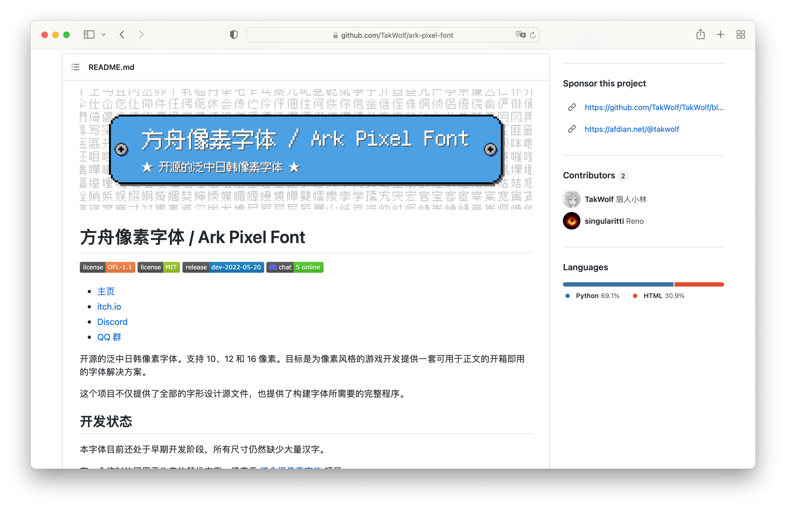
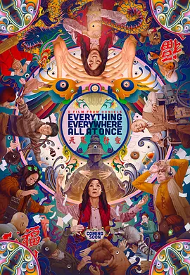
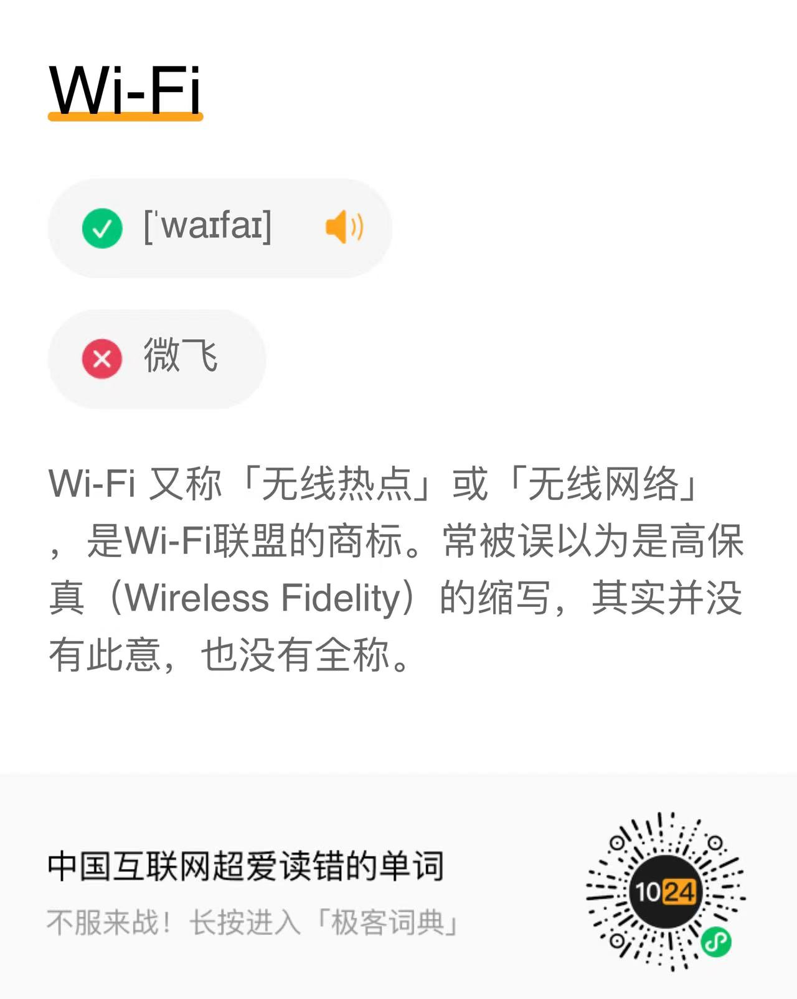

# 酷玩周刊 第 9 期

> 发掘一切有趣的数字生活

## 🚀 产品试玩

**[Elpass](https://elpass.app/)**

Surge 作者做的密码管理器，能存储密码、身份信息、加密文件，可选择 iCloud 和 Dropbox 同步数据，还有自动填充、指纹解锁、手表解锁等功能。

**[tossface](https://toss.im/tossface/myemoji)**

一套免费的emoji，比较好玩的是他可以让用户自己选择搭配两个emoji，生成一个新的emoji。

**[Language Reactor](https://www.languagereactor.com/)**

Language Reactor 能够给 Netflix、YouTube 或自己上传的视频添加字幕，并且提供逐句学习、生词查询的功能，对学习外语很有帮助。

**[QRBTF 参数化二维码生成器](https://qrbtf.com/)**

一个开源的二维码生成器，用户可以通过修改参数制作个性化的二维码，并提供了不少好看的主题。

## 😛 新奇古怪

**[DALL·E mini](https://huggingface.co/spaces/dalle-mini/dalle-mini)**

上次介绍的人工智能绘画工具 DALL·E 还在排队体验中，这里有个 DALL·E mini 简易的在线版本，效果比较粗糙，但可以提前体验一下。

**[Goods](https://goods.wtf/)**

这个网站里收录了许多设计精良的产品，包含一些生活用品、数码产品、办公用品等。

**[Emoji 大全](https://www.emojiall.com/zh-hans)**

这里收集了苹果、谷歌、微软、三星等各种版本的 emoji 表情，还提供了 emoji 高清图片、动画和矢量图的下载，是非常好的设计资源。

**[Pointer Pointer](https://pointerpointer.com/)**

指哪点哪，不知道这个网站哪里搞来的这么多奇怪的图片，只要鼠标放在网上，就会有人帮你指出来。

**[方舟像素字体 / Ark Pixel Font](https://github.com/TakWolf/ark-pixel-font)**

开源的中文像素字体，比较适合用来做游戏相关的项目。

## 📚 影音推荐

**[瞬息全宇宙](https://movie.douban.com/subject/30314848/)**

一个中年妇女突然面临多元宇宙的危机，剧情天马行空，脑洞大开，科幻外壳下也讨论了一些家庭问题。

**[爱，死亡和机器人 第三季](https://movie.douban.com/subject/35436582/)**

爱死机器人的第三季终于出来了，赛博朋克、克苏鲁、废土、海盗各种风格的剧集，看完只嫌太少了，来年又要等好久。

## 📝 每周一词\*

## ☎️ 关注订阅

- [欢迎投稿](https://wj.qq.com/s2/9741038/c74e/)
- [邮件订阅](https://www.getrevue.co/profile/coldplay-weekly)、[Telegram](https://t.me/ColdplayWeekly)、[GitHub](https://github.com/lvwzhen/coldplay-weekly)、[RSS](https://rsshub.app/telegram/channel/ColdplayWeekly)
- 制作团队：[ThusLab](https://thuscn.com/lab/)
- 关注公众号：酷玩一下

> 带\*标注是我们开发的产品，谢谢支持。

